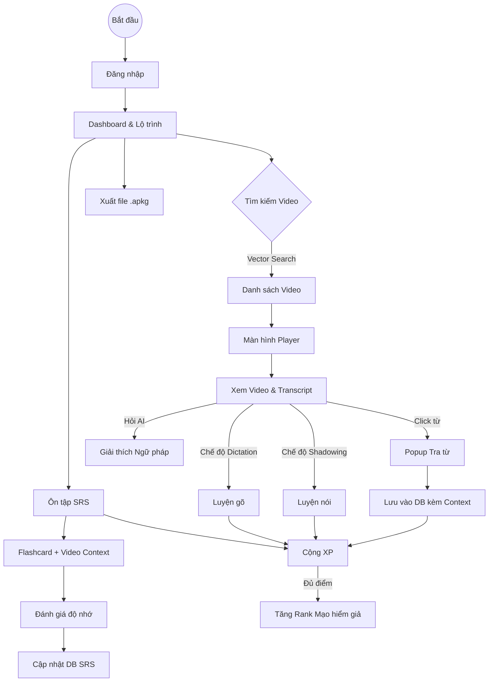

# USER FLOW DOCUMENTATION

**Dự án:** Ứng dụng Học tiếng Nhật qua Video (AI-Powered & Gamification)

**Ngày lập:** 05/01/2026

**Phiên bản:** 1.0

---

## 1. TỔNG QUAN HỆ THỐNG

Tài liệu này mô tả chi tiết các bước tương tác của người dùng (User) và phản hồi của hệ thống (System) cho nền tảng học tiếng Nhật. Luồng đi bao gồm từ lúc đăng nhập, học tập qua video, ôn tập từ vựng đến hệ thống phần thưởng nhập vai.

---

## 2. LUỒNG NGƯỜI DÙNG CHI TIẾT (DETAILED FLOWS)

### 2.1. Luồng Khởi tạo & Cá nhân hóa (Onboarding)

_Mục đích: Thiết lập hồ sơ, xác định trình độ và tùy biến giao diện ngay từ đầu._

1.  **Màn hình Chào mừng (Splash Screen)**
    - **User:** Chọn "Bắt đầu".
2.  **Đăng ký/Đăng nhập**
    - **User:** Nhập Email/Pass hoặc chọn Login with Google/Facebook.
    - **System:** Xác thực thành công -> Chuyển sang bước Setup (nếu là user mới).
3.  **Thiết lập Hồ sơ (Setup Wizard)**
    - **System:** Hỏi "Trình độ hiện tại của bạn?" (N5, N4, N3, N2, N1).
    - **User:** Chọn trình độ (Ví dụ: N3).
    - **System:** Hỏi "Mục tiêu học tập?" (Giao tiếp, Xem Anime, Thi JLPT).
    - **System:** Cho phép tùy chỉnh giao diện sơ bộ (Dark/Light mode, Cỡ chữ).
4.  **Tutorial (Hướng dẫn)**
    - **System:** Giới thiệu ngắn về hệ thống Rank và Mạo hiểm giả.
    - **System:** Dẫn User về Dashboard.

### 2.2. Luồng Quản lý & Xử lý Video (Admin/Uploader Flow)

_Mục đích: Đưa nội dung vào hệ thống và xử lý AI._

1.  **Upload/Import**
    - **User:** Tại trang Quản lý, chọn "Thêm Video".
    - **User:** Chọn nguồn:
      - _Option A:_ Upload file `.mp4` từ máy.
      - _Option B:_ Paste link YouTube/TikTok.
2.  **Xử lý AI (Backend Process - User chờ hoặc chạy ngầm)**
    - **System:** Tải video -> Tách Audio.
    - **System (AI Whisper):** Chuyển đổi giọng nói thành văn bản (STT) + Lấy timestamp.
    - **System (NLP Pipeline):**
      - Phân tích hình thái từ (Tokenization).
      - Gắn Furigana cho Kanji.
      - Gắn Cao độ (Pitch Accent).
      - Dịch nghĩa câu thoại.
      - Gắn tag trình độ (N5-N1) cho video dựa trên mật độ từ vựng.
    - **System (Vector DB):** Tạo Embeddings cho nội dung (phục vụ tìm kiếm ngữ nghĩa).
3.  **Hoàn tất**
    - **System:** Thông báo "Video đã sẵn sàng học".

### 2.3. Luồng Học tập Chính (Core Learning Flow)

_Mục đích: Trải nghiệm xem video, tra từ và tương tác._

1.  **Tìm kiếm & Chọn Video**
    - **User:** Tại Dashboard, nhập từ khóa hoặc câu thoại mong muốn (VD: "Câu tỏ tình lãng mạn").
    - **System:** Sử dụng **Vector Search** để tìm các video có nội dung/ý nghĩa tương tự -> Hiển thị list kết quả.
    - **User:** Click chọn Video.
2.  **Trình phát Video (Video Player Interface)**
    - **System:** Load Video + Transcript chạy đồng bộ.
    - **User Actions (Tùy chỉnh):**
      - User bật/tắt Furigana.
      - User chọn chế độ hiển thị: Song ngữ / Chỉ tiếng Nhật / Ẩn phụ đề.
3.  **Tương tác Tra từ (Lookup)**
    * **User:** Click vào một từ vựng bất kỳ trên dòng phụ đề.
    * **System:** Tự động **Pause** video.
    * **System:** Hiển thị **Popup Từ vựng**:
        * Nghĩa tiếng Việt.
        * Cách đọc (Hiragana/Romaji).
        * Biểu đồ Cao độ (Pitch Accent).
        * Ví dụ minh họa.
        * Nút **[Lưu vào Sổ tay]**.
4.  **Luồng Trả lời Trắc nghiệm (Quiz Interruption)**
    - **Condition:** Video phát đến điểm chốt (Key Moment).
    - **System:** Pause video -> Hiện **Quiz Popup**.
    - **User:** Chọn đáp án.
    - **System:**
      - _Đúng:_ Hiệu ứng chúc mừng -> Resume video.
      - _Sai:_ Hiện giải thích -> Cho phép thử lại.
5.  **Tương tác Chatbot AI**
    - **User:** Gặp cấu trúc ngữ pháp khó -> Bấm nút "Giải thích (AI)".
    - **System:** Chatbot phân tích câu hiện tại -> Giải thích ngữ pháp và sắc thái từ vựng trong ngữ cảnh đó.
6.  **Hoàn thành**
    - **User:** Xem hết video.
    - **System:** Cộng XP, cập nhật tiến độ xem.

### 2.4. Luồng Chế độ Luyện tập (Practice Mode)

_Các chế độ học sâu._

#### A. Shadowing (Nghe & Lặp lại)

1.  **User:** Bật chế độ Shadowing trên thanh control.
2.  **System:** Loop (lặp lại) câu thoại hiện tại.
3.  **User:** Nghe mẫu -> Bấm mic -> Nói nhại lại.
4.  **System:** Ghi âm -> Phát lại: [Giọng gốc] + [Giọng User] để so sánh.

#### B. Dictation (Nghe & Chép chính tả)

1.  **User:** Bấm "Luyện tạo câu/Gõ lại".
2.  **System:** Ẩn phụ đề -> Phát 1 câu thoại -> Pause.
3.  **User:** Gõ nội dung nghe được vào ô input -> Enter.
4.  **System:** So khớp kết quả:
    - _Đúng:_ Hiện xanh, cộng điểm.
    - _Sai:_ Hiện đỏ, hiển thị diff (sai chỗ nào).

### 2.5. Luồng Ôn tập Từ vựng (SRS & Review Flow)

_Hệ thống lặp lại ngắt quãng._

1.  **Kích hoạt**
    - **System:** Dashboard thông báo: "Hôm nay có 20 từ cần ôn".
    - **User:** Bấm "Ôn tập ngay".
2.  **Flashcard Session**
    - **System (Mặt trước):** Hiện Kanji/Từ vựng.
    - **User:** Nhớ nghĩa -> Bấm "Xem đáp án".
    - **System (Mặt sau):**
      - Hiện nghĩa, cách đọc.
      - **Auto-play đoạn video ngắn (clip)** chứa từ vựng đó (Lấy từ ngữ cảnh lúc lưu).
    - **User:** Đánh giá mức độ nhớ (Quên / Khó / Tốt / Dễ).
    - **System:** Tính toán thời gian lặp lại tiếp theo.
3.  **Kết thúc & Export**
    - **System:** Tổng kết phiên học -> Cộng XP.
    - **User (Option):** Vào cài đặt -> Chọn "Xuất .apkg" -> Tải file về import vào Anki.

### 2.6. Luồng Gamification (Hệ thống Mạo hiểm giả)

_Cơ chế thưởng và thăng cấp._

1.  **Tích lũy XP**
    - **Trigger:** User xem xong video, lưu từ mới, hoặc hoàn thành bài ôn tập.
    - **System:** Cộng XP tương ứng.
2.  **Level Up**
    - **Condition:** Khi XP đạt ngưỡng.
    - **System:** Hiển thị Animation "LEVEL UP" -> Tăng Rank (VD: Từ _Tập sự_ lên _Đồng_).
    - **System:** Mở khóa avatar hoặc khung viền mới.
3.  **Streak (Chuỗi ngày)**
    * **Condition:** User hoàn thành ít nhất 1 bài học trong ngày.
    * **System:** Tăng Streak counter +1.

### 2.7. Luồng Tham gia Cộng đồng (Community Flow)
1.  **Thảo luận**
    * **User:** Cuộn xuống dưới video -> Nhập bình luận/Câu hỏi.
    * **System:** Thông báo khi có người trả lời.
2.  **Chia sẻ thành tích**
    * **User:** Đạt Rank mới -> Bấm "Chia sẻ".
    * **System:** Tạo bài post trên Feed cộng đồng: "User A vừa đạt Rank Bạc!".

---

## 3. SƠ ĐỒ LUỒNG (DIAGRAM)

Dưới đây là sơ đồ tóm tắt luồng tương tác chính bằng Mermaid:

## 4. GHI CHÚ KỸ THUẬT (Dành cho Dev)

1. **Dữ liệu Lưu Từ (Vocab Data Structure):** Khi User lưu từ tại bước 2.3, Payload gửi về server cần bao gồm:

- `word_id`: ID của từ.
- `video_id`: ID của video gốc.
- `timestamp_start`: Thời gian bắt đầu câu thoại.
- `timestamp_end`: Thời gian kết thúc câu thoại.
- `full_sentence`: Toàn bộ câu chứa từ đó.

2. **Cơ chế Highlight:** Frontend cần so sánh `currentTime` của video player với mảng `segments` trong transcript JSON để tô màu từ đang nói theo thời gian thực (Real-time).
3. **Vector Search:** Sử dụng API Embeddings (OpenAI) để vector hóa query của user, sau đó query vào Vector Database (Pinecone/Milvus/Pgvector) để tìm video.
